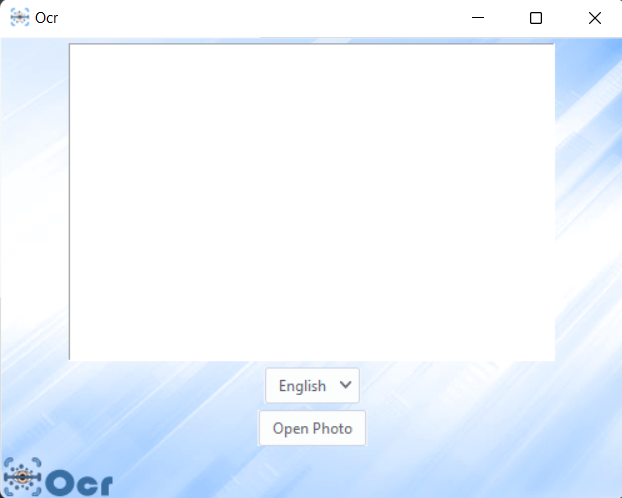

# OCR
This program extracts text from photos in English and Hebrew.

Steps: choose language -> open photo

To use this program you need to install [tesseract](https://tesseract-ocr.github.io/tessdoc/Home.html) on your computer.

